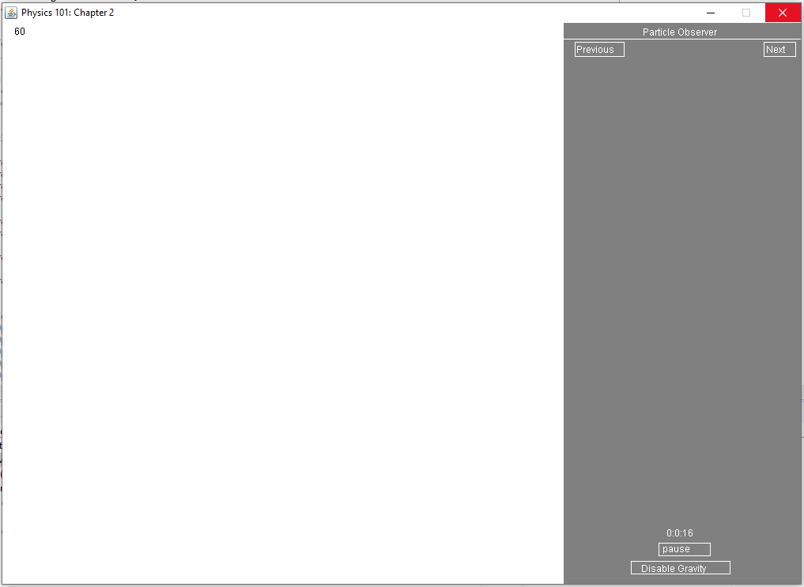
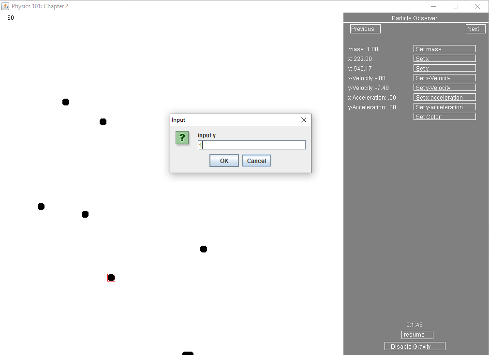
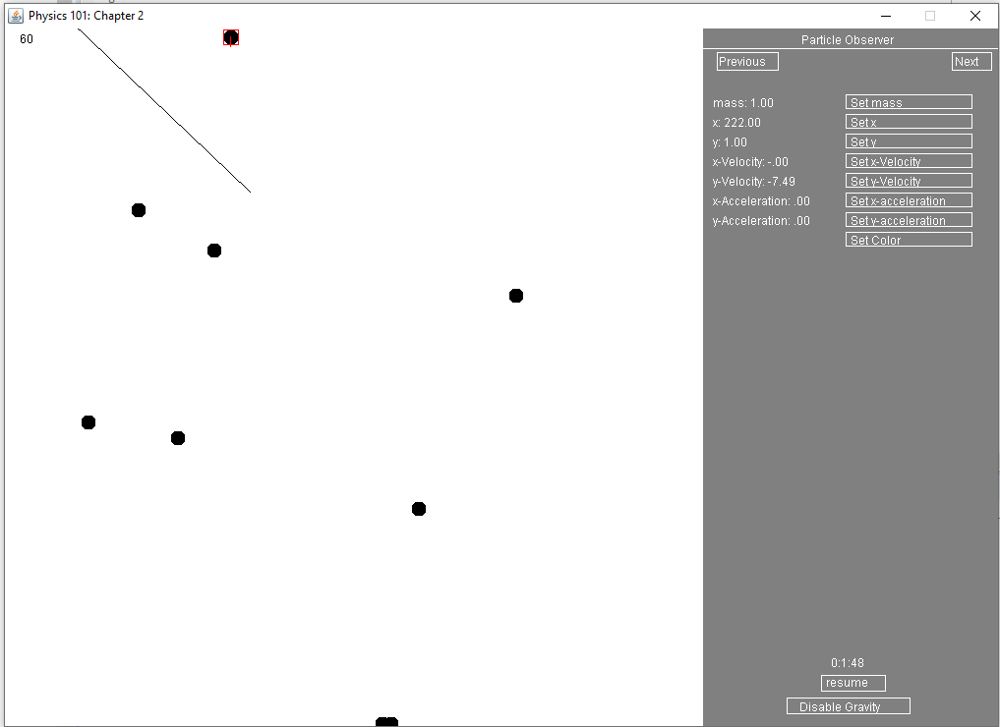

# JavaPhysics

A java physics simulator which allows a user to add particles, track their position, velocity, acceleration and mass, and edit the particles values. The user can add a particle with left clicking the mouse and dragging the mouse to set the direction and magnitude of the new particles velocity. Time and gravity can be toggled to change the particles behavior. Particles can be selected with the "Previous" and "Next" button as well as right clicking on the particle. 

The application was built while studying physics as a way to visualize the formulas and equation learned, which is why the application title is "Physics 101: Chapter 2" In future updates, the application would incorporate more advance physics such as wave physics, electric and magnetic physic and also and work in 3D. Also the collision could be updated to take mass into account and also be elastic.

Particles move in depending on their velocity and accelerations. Their movement is based on intro level particle physics.

When left click is pressed and dragged, a line is drawn to show the direction and magnitude of the velocity.
